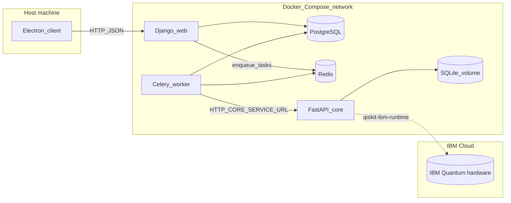

<div align="center">


# Blau — Water Quality Analysis Platform

*From water sample to lab-ready filter blueprint.*


[](#)
[](#)
[](#)

</div>

> **Blau is a research platform for water-purification scientists.** A genetic algorithm proposes nano-filter molecular lattices; first-principles quantum chemistry — running on real **IBM Quantum** hardware — scores them. A researcher goes from a Barcelona water sample to an exportable, lab-ready filter blueprint in minutes.

**Glossary note for contributors.** Blau uses *genetic optimisation* and *quantum chemistry* — not statistical learning. There are no neural networks, no training data, no learned models in this repository.

---

## The problem

- The Mediterranean carries **1.25 million microplastic fragments per km²** — 4× the density of the North Pacific garbage patch.
- The **Llobregat river** — the city's main drinking-water source — carries pharmaceutical residues, pesticides, and heavy metals from upstream industry.
- In **2008** Barcelona nearly ran out of water entirely.

The people fixing this are water-purification researchers — materials scientists who design nano-filters one molecular structure at a time. Their design loop is hand-written input files, hours of waiting, and weeks per iteration. Blau closes that loop.

---

## What Blau does

For a researcher, the workflow is one screen:

> Load a water sample → mark which pollutants matter → press **Generate** → get a 3D molecular structure of a candidate filter, per-pollutant removal-efficiency predictions, and an export to standard chemistry formats for the next stage of validation.

| Stage | What happens |
|---|---|
| **1. Measure** | Manual entry, CSV import, USB lab equipment, GEMStat dataset, or live-streamed from the optional Qualcomm-powered field station. |
| **2. Propose** | DEAP-driven genetic algorithm searches across 5 design genes (pore size, layer thickness, material type, functionalisation, doping). |
| **3. Score** | First-principles quantum chemistry computes binding energy at the electron level — Hartree-Fock baseline (PySCF) and VQE on **real IBM Quantum hardware** (PennyLane + qiskit-ibm-runtime). |
| **4. Blueprint** | A real atomic structure (honeycomb graphene with Kekulé bond orders, edge-attached functional groups, multi-layer stacking) — exportable as CSV, XYZ, or SDF. |

Every layer of every result is tagged with the level of theory that produced it (HF, VQE, empirical, proxied). For a research tool, provenance is the most important UX decision in the app.

---

## Screenshots

|  |  |
|---|---|
|  |  |
|  |  |
|  |  |
|  | |

---

## The science

### Genetic algorithm (DEAP)

`core/services/genetic_optimizer.py` evolves filter designs across **5 genes**:

| Gene | Range |
|---|---|
| Pore size | 0.3 – 2.0 nm |
| Layer thickness | 0.5 – 5.0 nm |
| Material type | graphene · CNT · graphene oxide · composite · MOF-like |
| Functionalisation density | 0 – 1 |
| Doping level | 0 – 1 (pyridinic-N replacement) |

Tournament selection · two-point crossover · Gaussian mutation · fitness = `|binding_energy|`. A `ProcessPoolExecutor` parallelises candidate evaluation.

### Quantum chemistry on IBM Quantum hardware

For every candidate filter, Blau computes the binding energy at the electron level:

```
E_bind = E(filter + pollutant) − E(filter) − E(pollutant)
```

`core/services/quantum_engine.py` routes each molecule through one of three levels of theory, picked automatically by `compute_binding_energy()`:

- **Hartree-Fock** (PySCF, STO-3G basis) — deterministic, millisecond baseline.
- **VQE** (Variational Quantum Eigensolver) with a **UCCSD ansatz**, executed via PennyLane's `qiskit.remote` device on top of **qiskit-ibm-runtime**, **on real IBM Quantum hardware** when `IBM_QUANTUM_TOKEN` is set. 1024 shots per measurement.
- **Empirical fallbacks** — van der Waals + DFT-D3-calibrated ionic models for systems STO-3G can't represent.

**Heavy elements are a deliberate scientific choice, not a hidden caveat.** STO-3G has no basis for Z > 36, so lead, mercury, and cadmium would crash the engine. Blau substitutes them with same-group lighter atoms (Pb → Ge, Hg → Zn, Cd → Zn) and surfaces the substitution in the UI so a reviewer always knows what was actually computed.

### Classical lattice construction

Genes alone aren't a filter — they have to become a real atomic structure. `core/routers/filters.py` does that work:

- Honeycomb graphene generated from the lattice constant **a = 2.46 Å** (C-C bond = `a/√3`).
- **Kekulé bond-order assignment** via BFS 2-colouring of the bipartite honeycomb graph — every aromatic carbon ends up with the chemically correct alternating-double-bond pattern.
- Edge-atom detection plus chemistry-aware functional-group attachment: **-COOH** for heavy-metal chelation, **-NH₂** for anionic pollutants, **-OH** as the default hydrogen-bonding site.
- Multi-layer stacking with the correct van der Waals interlayer spacing (3.4 Å).
- Distance-threshold bond detection over the final atom set.

A curated **450+-entry pollutant map** (`core/services/pollutant_map.py`) translates measured water parameters (heavy metals, OCPs, OPs, triazines, PAHs, VOCs, PFAS, phenols, pharmaceuticals, microplastics) into the dominant atomic-site representation that quantum chemistry can actually compute on.

---

## Architecture

Multi-tier, fully Dockerised. The Electron client never talks to the simulation engine directly — only the Celery worker does, so heavy compute and quantum jobs run out-of-band from any user-facing request.



- **Electron client → Django `web`:** JWT-authenticated JSON over HTTP (`http://localhost:8000` from the host). The desktop app **does not** call the core service; only the backend worker does.
- **Django `web` → PostgreSQL & Redis:** reads/writes application data; enqueues Celery jobs (e.g. filter generation).
- **Celery `worker` → PostgreSQL, Redis, and core:** executes tasks and calls the simulation service at `CORE_SERVICE_URL` (default `http://core:8000` on the internal network). See [server/backend/filters/services/runner.py](server/backend/filters/services/runner.py) (`POST /filters/generate` and status polling).
- **Core → IBM Quantum:** when `IBM_QUANTUM_TOKEN` is set, VQE jobs are dispatched to a real IBM Quantum backend via `qiskit-ibm-runtime`.
- **Core local state:** SQLite on the `core-data` volume. For debugging, core is exposed on the host at port **8001**.

---

## Hardware companion (Qualcomm sponsor track)

For longitudinal campaigns on a real water source, an **Arduino UNO Q** (Qualcomm **QRB2210** SoC) running a Python app inside the Uno Q App Lab reads a **Modulino Thermo (HS3003)** over I²C and POSTs measurements over WiFi to the Blau API. Measurements appear live in the researcher's active study. The platform doesn't require it; researchers running real fieldwork do. Source: [`firmware/blau_uno_q_app/`](firmware/blau_uno_q_app/).

---

## Tech stack

| Component | Technologies |
|-----------|-------------|
| **Core (simulation)** | FastAPI, PySCF (Hartree-Fock), PennyLane + qiskit-ibm-runtime (VQE on IBM Quantum), DEAP (genetic algorithms), SQLite |
| **Backend** | Django, Django REST Framework, Celery, Redis, PostgreSQL, JWT |
| **Desktop client** | Electron, React 19, TypeScript, Vite, Tailwind CSS, Leaflet (maps), Recharts, 3Dmol.js (molecular viewer), serialport (USB devices) |
| **Landing page** | Vite + React, plain CSS |
| **Field station** | Arduino UNO Q (Qualcomm QRB2210), Modulino Thermo HS3003, Python, WiFi HTTP |
| **Infrastructure** | Docker Compose, PostgreSQL 16, Redis 7 |

## Repository layout

| Path | Role |
|------|------|
| [core/](core/) | FastAPI simulation engine: `/health`, `/filters/*`. Runs quantum chemistry (PySCF + PennyLane VQE on IBM Quantum) and genetic algorithm optimisation (DEAP). Uses SQLite on a Docker volume (`DB_PATH=/data/h2osim.db`) and a process pool for heavy work. |
| [server/backend/](server/backend/) | Django REST API, Celery tasks, and app code. In Compose, `./server/backend` is mounted at `/home/app/backend` in the `web` and `worker` containers. |
| [server/](server/) | Docker image build, `requirements.txt`, and `env.example` for backend configuration. |
| [client/](client/) | Electron + Vite + React. API calls use `VITE_API_BASE_URL`; request paths include `/api/...` (see [client/src/renderer/src/utils/api/config.ts](client/src/renderer/src/utils/api/config.ts)). |
| [landing/](landing/) | Optional Vite + React marketing/portfolio site; not wired into `docker-compose.yml`. Run locally with `npm install` and `npm run dev`. |
| [firmware/](firmware/) | Optional field station — Arduino UNO Q (Qualcomm QRB2210) Python app. |
| [docs/](docs/) | Product documentation, DevPost submission copy, hardware setup. |

---

## Prerequisites

- **Full stack:** [Docker](https://docs.docker.com/get-docker/) and Docker Compose v2.
- **Desktop client:** Node.js (LTS) and npm, for [client/](client/).
- **Landing page (optional):** Node.js and npm in [landing/](landing/).

Python dependencies are installed inside the Docker images from [server/requirements.txt](server/requirements.txt) and [core/requirements.txt](core/requirements.txt). For local Python work outside Docker, use those files with a virtual environment.

## Quick start: backend and core (Docker)

From the repository root:

1. Copy the environment template and fill in secrets:

   ```bash
   cp server/env.example server/.env
   ```

   Set at minimum a strong `SECRET_KEY`, `DB_PASSWORD` / `POSTGRES_PASSWORD` (same value), and Google OAuth values if you use Google login. See [Environment variables](#environment-variables) below.

2. Start all services:

   ```bash
   docker compose up --build
   ```

3. **Ports (default [docker-compose.yml](docker-compose.yml)):**

   | Service | Host port | Notes |
   |---------|-----------|--------|
   | Django API (`web`) | **8000** | REST API and `/api/health/` |
   | Core (`core`) | **8001** | `/health` and `/filters/*` |
   | PostgreSQL (`db`) | **5434** | Optional host access |
   | Redis | *(none)* | Reachable only inside the Compose network |

4. Smoke checks:

   - API: `GET http://localhost:8000/api/health/`
   - Core: `GET http://localhost:8001/health`

Optional: a separate benchmark-oriented compose file is [docker-compose.benchmark.yml](docker-compose.benchmark.yml) (different host ports for core/DB, and core tuned for benchmarking).

After starting the stack, you can run [server/check_services.ps1](server/check_services.ps1) or [server/check_services.sh](server/check_services.sh) if you want scripted checks against local URLs.

## Desktop client

```bash
cd client
npm install
npm run dev
```

Create `client/.env` (or use `.env.local`) with the Django API origin:

```bash
VITE_API_BASE_URL=http://localhost:8000
```

The client builds request paths like `/api/auth/login/`; [client/src/renderer/src/utils/api/config.ts](client/src/renderer/src/utils/api/config.ts) accepts either a bare origin (`http://localhost:8000`) or a base URL ending in `/api`. Do not commit environment files that point to private or production APIs unless you intend to.

### Serving the same client from Django (production / `Frontend not found`)

Django serves the React SPA from `server/backend/static/client/dist/` (e.g. `index.html` plus `assets/`). Build the renderer and copy it there:

```bash
cd client
npm install
npm run build
# electron-vite writes the web bundle under out/renderer/
mkdir -p ../server/backend/static/client/dist
cp -r out/renderer/* ../server/backend/static/client/dist/
```

On the server (paths match `/home/app/backend` in Docker), the same copy targets `/home/app/backend/static/client/dist/`. Public installers can live under `/var/www/downloads/`; Django exposes `GET /downloads/client-latest.AppImage` and `GET /downloads/blau-setup.exe` (override paths with `LINUX_APPIMAGE_PATH` / `WINDOWS_SETUP_PATH` in `.env`).

### Key client features

- **Water measurement management** — manual entry, CSV import, USB/serial lab equipment integration, GEMStat dataset browser
- **Interactive map** — Leaflet-based station visualisation with marker clustering
- **Filter generation** — multi-pollutant selection, quantum-hardware toggle, real-time progress polling
- **3D molecular viewer** — 3Dmol.js visualisation of generated filter structures
- **Charts and analytics** — Recharts-based pollutant concentration and filter performance charts

## Optional landing page

```bash
cd landing
npm install
npm run dev
```

## Environment variables

The canonical template is [server/env.example](server/env.example). Docker Compose loads [server/.env](server/.env) for the `db`, `web`, and `worker` services.

### Required for a working Compose stack

| Variable | Purpose |
|----------|---------|
| `SECRET_KEY` | Django signing; must be long and random when `DEBUG=False`. |
| `DB_NAME`, `DB_USER`, `DB_PASSWORD`, `DB_HOST`, `DB_PORT` | Django database connection (`DB_HOST=db` and `DB_PORT=5432` inside Compose). |
| `POSTGRES_DB`, `POSTGRES_USER`, `POSTGRES_PASSWORD` | Must match the database name, user, and password expected by Django (used by the PostgreSQL container). |

### Usually set in `env.example` / Compose overrides

| Variable | Purpose |
|----------|---------|
| `DEBUG`, `ALLOWED_HOSTS`, `CORS_ALLOW_ALL_ORIGINS` | Dev vs production behaviour and CORS. |
| `CELERY_BROKER_URL`, `CELERY_RESULT_BACKEND` | Redis URLs (`redis://redis:6379/0` in Compose). |
| `CELERY_TASK_TIME_LIMIT`, `CELERY_TASK_SOFT_TIME_LIMIT` | Task timeouts (soft limit should stay below hard limit). |
| `CORE_SERVICE_URL` | Base URL for the core service (`http://core:8000` inside Docker). |

### Email (for password reset)

| Variable | Purpose |
|----------|---------|
| `EMAIL_HOST` | SMTP server (e.g. `smtp.gmail.com`). |
| `EMAIL_PORT` | SMTP port. |
| `EMAIL_USE_TLS` | Enable TLS (`True`/`False`). |
| `EMAIL_HOST_USER` | SMTP login email. |
| `EMAIL_HOST_PASSWORD` | SMTP app password. |
| `DEFAULT_FROM_EMAIL` | Sender address for outgoing emails. |

### Core service (quantum simulation)

These are set in `docker-compose.yml` under the `core` service and can be overridden with host environment variables or a `.env` file:

| Variable | Default | Purpose |
|----------|---------|---------|
| `DB_PATH` | `/data/h2osim.db` | SQLite database path for simulation state. |
| `CORE_WORKERS` | `2` | Number of process pool workers for parallel simulation. |
| `USE_VQE` | `1` | Enable VQE quantum refinement (`1`) or use Hartree-Fock only (`0`). |
| `VQE_ACTIVE_ELECTRONS` | `4` | Number of active electrons in the VQE active space. |
| `VQE_ACTIVE_ORBITALS` | `4` | Number of active orbitals in the VQE active space. |
| `VQE_MAX_ITERATIONS` | `80` | Maximum VQE optimiser iterations. |
| `IBM_QUANTUM_TOKEN` | *(empty)* | IBM Quantum API token. When set, VQE runs on real quantum hardware instead of the simulator. |
| `IBM_QUANTUM_BACKEND` | `ibm_sherbrooke` | IBM Quantum backend device name. |
| `IBM_QUANTUM_SHOTS` | `1024` | Number of measurement shots per VQE circuit on hardware. |

### Optional / feature-specific

| Variable | Purpose |
|----------|---------|
| `GOOGLE_CLIENT_ID`, `GOOGLE_CLIENT_SECRET` | Google OAuth. |
| `LINUX_APPIMAGE_PATH` | Path to a desktop artifact served by Django (see [server/backend/backend/settings.py](server/backend/backend/settings.py)). |
| `GEMSTAT_DATASET_DIR` | Reserved in `env.example`; ingestion uses the path you pass to `sync_gemstat_measurements` (see below). |

### Example `server/.env` (replace all secrets)

```env
SECRET_KEY=dev-only-change-me-use-secrets-token-urlsafe-in-real-deploys
DEBUG=True
ALLOWED_HOSTS=localhost,127.0.0.1
CORS_ALLOW_ALL_ORIGINS=True

DB_NAME=thegreatfilter
DB_USER=postgres
DB_PASSWORD=local-dev-postgres-password
DB_HOST=db
DB_PORT=5432

POSTGRES_DB=thegreatfilter
POSTGRES_USER=postgres
POSTGRES_PASSWORD=local-dev-postgres-password

EMAIL_HOST=smtp.gmail.com
EMAIL_PORT=587
EMAIL_USE_TLS=True
EMAIL_HOST_USER=your-email@gmail.com
EMAIL_HOST_PASSWORD=your-app-password
DEFAULT_FROM_EMAIL=your-email@gmail.com

CELERY_BROKER_URL=redis://redis:6379/0
CELERY_RESULT_BACKEND=redis://redis:6379/0
CELERY_TASK_TIME_LIMIT=1800
CELERY_TASK_SOFT_TIME_LIMIT=1500

CORE_SERVICE_URL=http://core:8000

GOOGLE_CLIENT_ID=your-google-client-id.apps.googleusercontent.com
GOOGLE_CLIENT_SECRET=your-google-client-secret
```

### Client example

```env
VITE_API_BASE_URL=http://localhost:8000
```

## GEMStat dataset (optional import)

Public measurement data can be loaded from the **UNEP GEMS/Water Global Freshwater Quality Archive** (GEMStat export). Use **version v3** on Zenodo:

- Dataset page: [https://zenodo.org/records/18459694](https://zenodo.org/records/18459694)
- Direct zip: [GFQA_v3.zip](https://zenodo.org/records/18459694/files/GFQA_v3.zip?download=1)
- DOI: [10.5281/zenodo.18459694](https://doi.org/10.5281/zenodo.18459694)

The archive is licensed **CC BY 4.0**; credit the dataset and authors as required on the record page.

### Where to put the files

1. Create a folder **`server/backend/dataset/`** on your machine (repo root relative path).
2. Extract or copy CSVs so **all needed files sit in that folder** (flat directory). The importer loads station and parameter catalogs from:
   - `GEMStat_station_metadata.csv`
   - `GEMStat_parameter_metadata.csv`
   Files whose names start with `GEMStat_` are not used as parameter timeseries inputs; other `*.csv` files in the same directory are candidates for `--files`.

Inside Docker, the same directory appears as **`/home/app/backend/dataset`** because `./server/backend` is bind-mounted to `/home/app/backend`.

### Import command

With the stack running, from the **repository root**, prefer Compose's service name (avoids guessing container names like `thegreatfilter-web-1`):

```bash
docker compose exec web python manage.py sync_gemstat_measurements /home/app/backend/dataset \
  --files Temperature.csv pH.csv Water.csv Electrical_Conductance.csv Chloride.csv Sodium.csv \
  Calcium.csv Magnesium.csv Potassium.csv Sulfur.csv \
  --max-snapshots 50000
```

Equivalent with an explicit container name:

```bash
docker exec -it thegreatfilter-web-1 python manage.py sync_gemstat_measurements /home/app/backend/dataset \
  --files Temperature.csv pH.csv Water.csv Electrical_Conductance.csv Chloride.csv Sodium.csv \
  Calcium.csv Magnesium.csv Potassium.csv Sulfur.csv \
  --max-snapshots 50000
```

Imports can take a long time and use substantial disk and database space. The `--files` list limits which parameter CSVs are read; the two `GEMStat_*` metadata CSVs above must still be present in the dataset directory.

---

## Team & credits

- Built at **HackUPC 2026** (Barcelona).
- Sponsor track: **Qualcomm** — Arduino UNO Q field station with the QRB2210 SoC.
- Quantum execution: **IBM Quantum** via `qiskit-ibm-runtime`.
- Public-data attribution: **UNEP GEMS/Water Global Freshwater Quality Archive** (GEMStat v3, [Zenodo 10.5281/zenodo.18459694](https://doi.org/10.5281/zenodo.18459694)) — CC BY 4.0.
- Full DevPost submission copy: [`docs/devpost-submission.md`](docs/devpost-submission.md).
